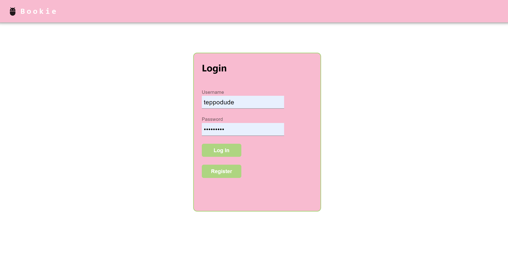
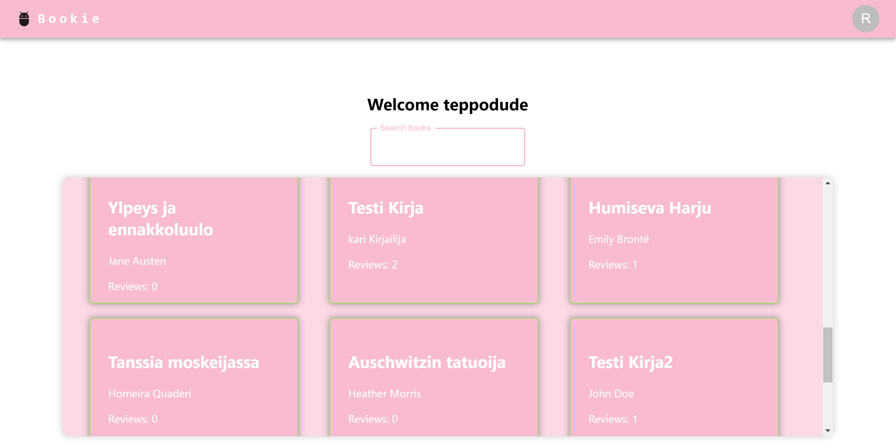
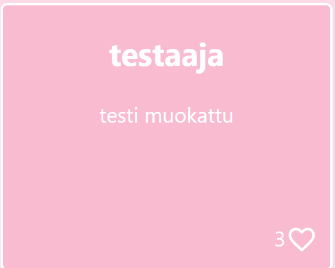
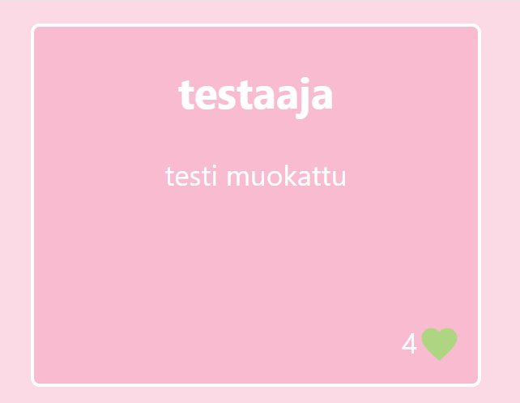

# Bookreview page 2.0

# NOTE! this project is a work inprogress and will be worked on when there is time.

## this is updated version of my fullstack app bookreview. this second version is recreated with react and it's main purpose is to learn using MERN stack in a wider project.

### 15.2.2024

Implemented some routing and login/logout logic. Got books rendered and a route to bookreview page.

Color scheme is a cute pink, because yesterday was valentines day ^^

Got reviews rendered. Started creating a like function, added likes to book schemas review item

Also tried MUI components a litle bit, might implement more into this page.

### current login page

### current book list (navbar user icon needs a photo)

need to learn how to save pictures to mongodb, apperently they need to be for example base64 encoded

### 16.2

added a like feature, and it seems to work really well.

