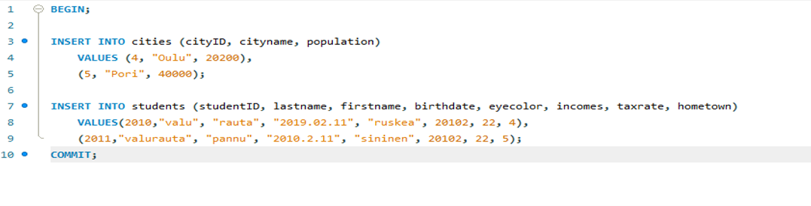
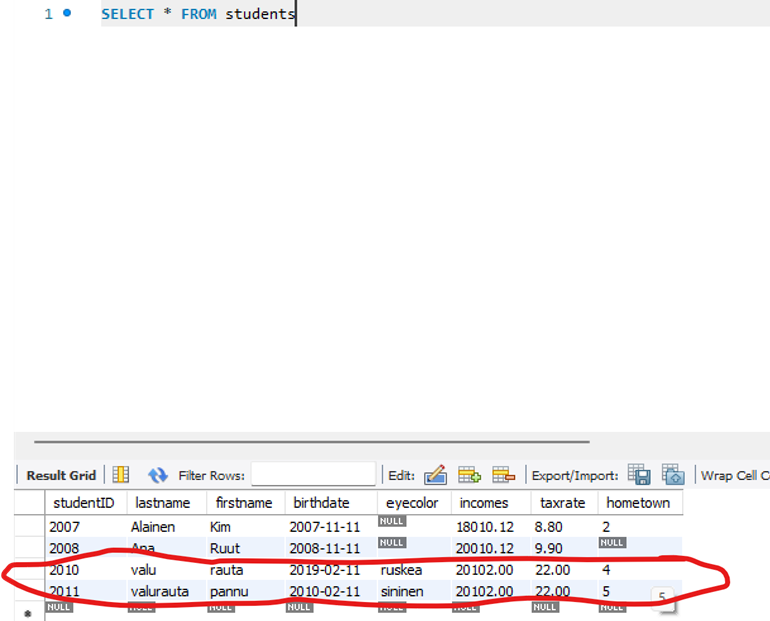
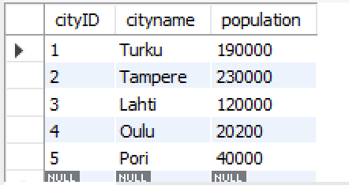
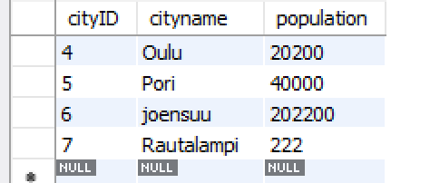

### Databases excersice 8 0/16P

### Tehtävä1 

Luo sellainen triggeri opintojakson esimerkkitietokantaan http://netisto.fi/oppaat/tietokannat/?id=03, että yli miljoonan asukkaan kotikaupunkeja ei voi lisätä INSERT INTO -lauseella cities-tauluun.

Palautuksesta tulee ilmetä, että että yli miljoonan asukkaan kotikaupunkien lisäys ei onnistu.

Poista luomasi triggeri sen toiminnan testauksen jälkeen.

DELIMITER $$
CREATE TRIGGER trigger1
	BEFORE INSERT ON cities
    FOR EACH ROW 
BEGIN
	IF ! (NEW.population > 1000000) THEN
		CALL `Virhe: Ei voi lisätä yli miljoonan asukkaan kotikaupunkia`;
	END IF;
END $$

INSERT INTO cities VALUES (5,"Kemi",1000000)

Error Code: 1305. PROCEDURE AC7750_1.Virhe: Ei voi lisätä yli miljoonan asukkaan kotikaupunkia does not exist

### TEHTÄVÄ2 2/2P
Luo transaktio jossa opintojakson esimerkkitietokannan http://netisto.fi/oppaat/tietokannat/?id=03

1) cities-tauluun lisätään kaksi uutta kaupunkia yhdellä INSERT INTO -lauseella JA
2) students-tauluun lisätään kaksi uutta opiskelijaa yhdellä INSERT INTO -lauseella, joiden kotikuntana on jompikumpi kohdassa A) lisätyistä kotikaupungeista

 
 

### TEHTÄVÄ 3 2/2P
Luo transaktio jossa opintojakson esimerkkitietokannan http://netisto.fi/oppaat/tietokannat/?id=03

1) cities-tauluun lisätään kaksi uutta kaupunkia yhdellä INSERT INTO -lauseella JA
2) students-tauluun lisätään kaksi uutta opiskelijaa yhdellä INSERT INTO -lauseella, joiden studentID on virheellisesti sama

 

### TEHTÄVÄ 4 4/4P

Luo edellisen tehtävän transaktion yhteyteen sellainen sp_fail()-niminen tallennettu proseduuri (stored procedure), jota kutsuessa kaikki INSERT INTO-lauseet peruutetaan (ROLLBACK), jos yhdenkin suoritus epäonnistuu jostakin syystä. Jos kaikki INSERT INTO -lauseet ovat suoritettavissa, transaktio hyväksytään kokonaisuudessaan (COMMIT).

Käytä luomaasi tallennettua proseduuria kutsumalla sitä CALL sp_fail;

Palautuksesta tulee ilmetä, että kaupunkienkaan lisäys ei onnistunut, jos jonkun opiskelijan lisäys ei onnistunut.

 
Tarkoituksella studenteissa virhe, 2011 id:llä on jo sama opiskelija
 
0 rows affected

| Execute:                                          |            |            |
|---------------------------------------------------|------------|------------|
| > SELECT * FROM cities                            |            |            |
|                                                   |            |            |
| + ----------- + ------------- + --------------- + |            |            |
| cityID                                            | cityname   | population |
| + ----------- + ------------- + --------------- + |            |            |
| 1                                                 | Turku      | 190000     |
| 2                                                 | Tampere    | 230000     |
| 3                                                 | Lahti      | 120000     |
| 4                                                 | Oulu       | 20200      |
| 5                                                 | Pori       | 40000      |
| 6                                                 | joensuu    | 202200     |
| 7                                                 | Rautalampi | 222        |
| NULL                                              | NULL       | NULL       |
| + ----------- + ------------- + --------------- + |            |            |
| 8 rows                                            |            |            |

Niin kuin tulosteesta näkee vielä että uusia kaupunkeja ei lisätty.

