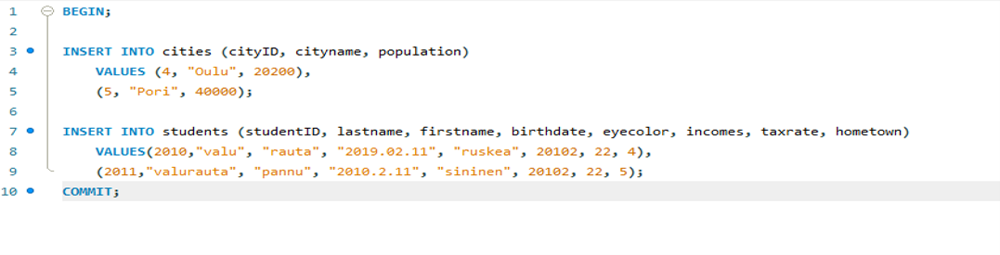
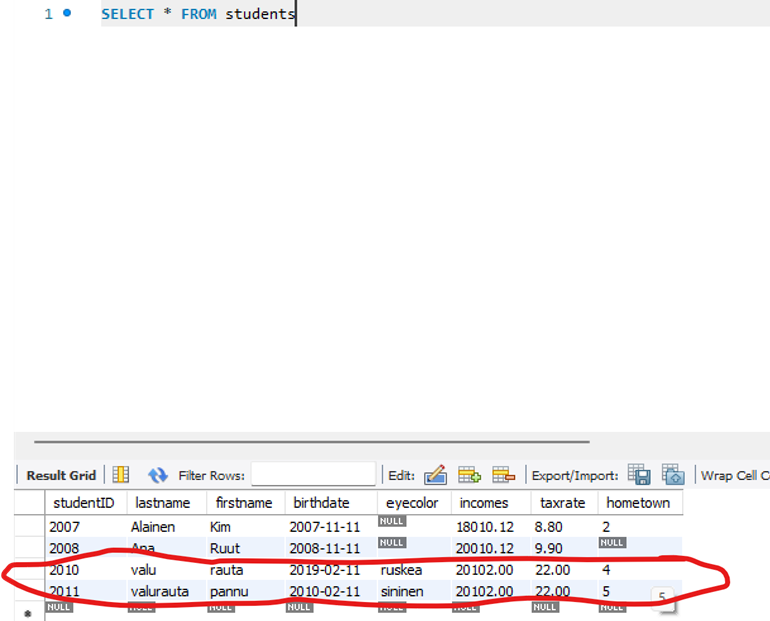
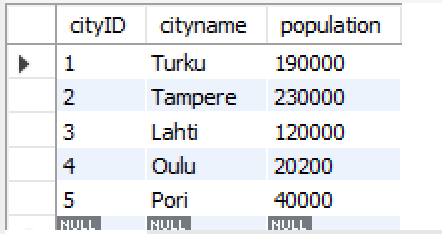
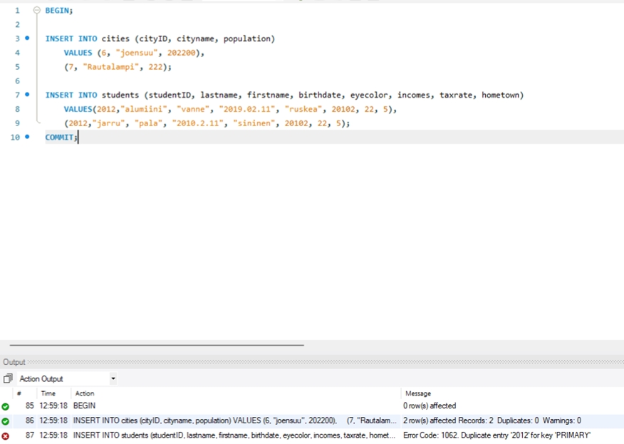
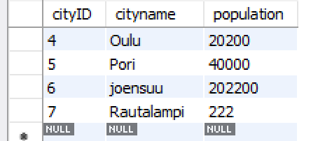
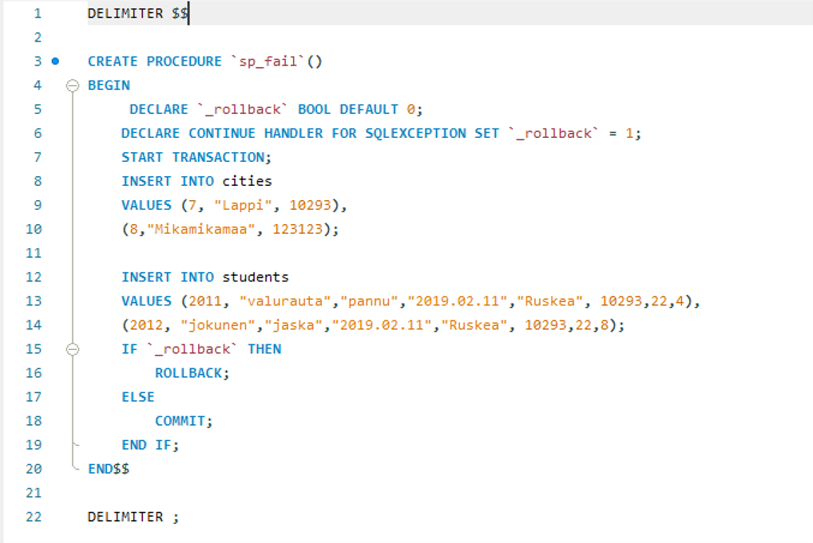
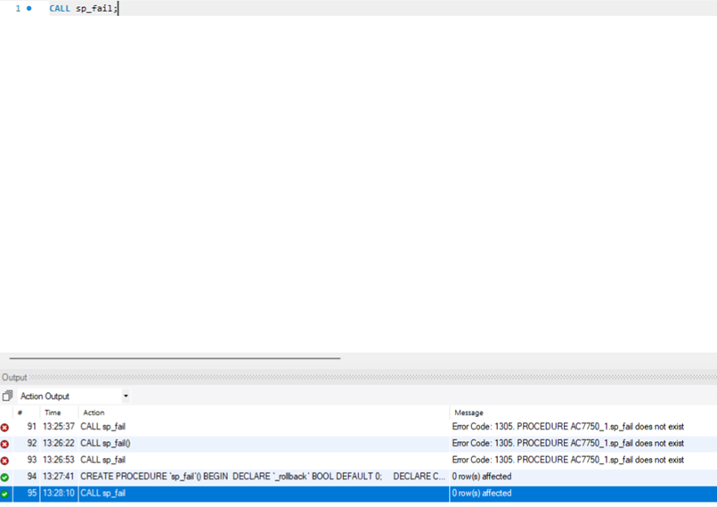

### Databases excersice 8 0/16P

### Tehtävä1 

Luo sellainen triggeri opintojakson esimerkkitietokantaan http://netisto.fi/oppaat/tietokannat/?id=03, että yli miljoonan asukkaan kotikaupunkeja ei voi lisätä INSERT INTO -lauseella cities-tauluun.

Palautuksesta tulee ilmetä, että että yli miljoonan asukkaan kotikaupunkien lisäys ei onnistu.

Poista luomasi triggeri sen toiminnan testauksen jälkeen.

DELIMITER $$
CREATE TRIGGER trigger1
	BEFORE INSERT ON cities
    FOR EACH ROW 
BEGIN
	IF ! (NEW.population > 1000000) THEN
		CALL `Virhe: Ei voi lisätä yli miljoonan asukkaan kotikaupunkia`;
	END IF;
END $$

INSERT INTO cities VALUES (5,"Kemi",1000000)

Error Code: 1305. PROCEDURE AC7750_1.Virhe: Ei voi lisätä yli miljoonan asukkaan kotikaupunkia does not exist

### TEHTÄVÄ2 2/2P
Luo transaktio jossa opintojakson esimerkkitietokannan http://netisto.fi/oppaat/tietokannat/?id=03

1) cities-tauluun lisätään kaksi uutta kaupunkia yhdellä INSERT INTO -lauseella JA
2) students-tauluun lisätään kaksi uutta opiskelijaa yhdellä INSERT INTO -lauseella, joiden kotikuntana on jompikumpi kohdassa A) lisätyistä kotikaupungeista

 
 

### TEHTÄVÄ 3 2/2P
Luo transaktio jossa opintojakson esimerkkitietokannan http://netisto.fi/oppaat/tietokannat/?id=03

1) cities-tauluun lisätään kaksi uutta kaupunkia yhdellä INSERT INTO -lauseella JA
2) students-tauluun lisätään kaksi uutta opiskelijaa yhdellä INSERT INTO -lauseella, joiden studentID on virheellisesti sama

 

## TEHTÄVÄ 4 4/4P

Luo edellisen tehtävän transaktion yhteyteen sellainen sp_fail()-niminen tallennettu proseduuri (stored procedure), jota kutsuessa kaikki INSERT INTO-lauseet peruutetaan (ROLLBACK), jos yhdenkin suoritus epäonnistuu jostakin syystä. Jos kaikki INSERT INTO -lauseet ovat suoritettavissa, transaktio hyväksytään kokonaisuudessaan (COMMIT).

Käytä luomaasi tallennettua proseduuria kutsumalla sitä CALL sp_fail;

Palautuksesta tulee ilmetä, että kaupunkienkaan lisäys ei onnistunut, jos jonkun opiskelijan lisäys ei onnistunut.

 
### Tarkoituksella studenteissa virhe, 2011 id:llä on jo sama opiskelija
 

 
 
 
 
0 rows affected

| Execute:                                          |            |            |
|---------------------------------------------------|------------|------------|
| > SELECT * FROM cities                            |            |            |
|                                                   |            |            |
| + ----------- + ------------- + --------------- + |            |            |
| cityID                                            | cityname   | population |
| + ----------- + ------------- + --------------- + |            |            |
| 1                                                 | Turku      | 190000     |
| 2                                                 | Tampere    | 230000     |
| 3                                                 | Lahti      | 120000     |
| 4                                                 | Oulu       | 20200      |
| 5                                                 | Pori       | 40000      |
| 6                                                 | joensuu    | 202200     |
| 7                                                 | Rautalampi | 222        |
| NULL                                              | NULL       | NULL       |
| + ----------- + ------------- + --------------- + |            |            |
| 8 rows                                            |            |            |

Niin kuin tulosteesta näkee vielä että uusia kaupunkeja ei lisätty.

## Tehtävä5 

### A) Luo kuvitteellista keskustelufoorumi-ohjemiston viestien tallentamista varten tietokannan taulu, jossa perusavaimena on juokseva numero (kokonaisluku). Muita kenttiä tulee olla ainakin viestin otsikkoa, kirjoittajaa ja sisältöä varten. Myös viestin lisäysajankohta tulee tallentaa. Lisäksi tulee olla INTEGER-tyyppinen "parent"-kenttä, joka kertoo numerollaan, minkä viestin vastaus se mahdollisesti on. "Parent"-kentän arvo asetetaan NULL, jos viesti on viestiketjun avaava viesti. "Parent"-kenttä tulee olla viiteavaimena taulun perusavaimelle.

CREATE TABLE Messages(
	messageID INT auto_increment PRIMARY KEY,
    topic VARCHAR(64) NOT NULL,
    user VARCHAR(15) NOT NULL,
    content VARCHAR(255) NOT NULL,
    posted TIMESTAMP NOT NULL DEFAULT now(),
    parent INT DEFAULT NULL,
		FOREIGN KEY (parent)
        references Messages (messageID)
)

### B) Lisää tauluun sisältöä siten, että viestejä on vähintään kolmella tasolla kuten oheisessa esimerkissä. On siis keskustelun avaavia viestejä, niiden vastauksia ja vastauksien vastauksia. Lisättyjen viesttien ei tietenkään tarvitse olla oheisen esimerkin mukaisia

INSERT INTO Messages(topic, user, content, parent) VALUES
	("Ensimmäinen postaus :D", "käyttis1", "MEitsi oli eka :)", NULL),
    ("Toka :DDD", "peke", "Mä olin toka", NULL),
    ("vastaan sulle", "joniboi", "moikka", 2),
    ("superii", "superdude","meitsi on iha super",2),
    ("vastaan superdudelle", "superimpidude","meitsi on varmaa enemmä super",4),
    ("poronkäristys appreciation post", "käristäjä","onko parempaa safkaa olemassa kuan poronkäristys? Tuskin",NULL),
	("oon eri mieltä", "HKMIES", "on kyl varmasti parempaa HK sinine lenkki ku sinu käristys",6),
    ("PYH", "käristäjä", "joudut kohta ite käristetyks",7);

### C) Tee SQL-kysely, jolla haetaan kaikki ensimmäisen tason viestien vastaukset.

Execute:
> SELECT * 
FROM Messages 
Where parent IN 
	(SELECT messageID FROM Messages WHERE parent IS NULL)

+ -------------- + ---------- + --------- + ------------ + ----------- + ----------- +
| messageID      | topic      | user      | content      | posted      | parent      |
+ -------------- + ---------- + --------- + ------------ + ----------- + ----------- +
| 3              | vastaan sulle | joniboi   | moikka       | 2023-03-13 10:26:36 | 2           |
| 4              | superii    | superdude | meitsi on iha super | 2023-03-13 10:26:36 | 2           |
| 7              | oon eri mieltä | HKMIES    | on kyl varmasti parempaa HK sinine lenkki ku sinu käristys | 2023-03-13 10:26:36 | 6           |
| NULL           | NULL       | NULL      | NULL         | NULL        | NULL        |
+ -------------- + ---------- + --------- + ------------ + ----------- + ----------- +
4 rows

