### Tietokannat Harjoitus 2

### Tehtävä1 

## A. Hae kaikki kaupungit (cities); kaikki sarakkeet näkyviin

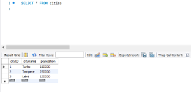
 
## B. Hae kaikkien kaupunkien nimet ja asukasluvut. Lajittele asukasmäärän mukaan pienimmästä suurimpaan.
 

 
##C. Mitä eri silmien värejä opiskelijoilla on? Kukin väri saa tulostua vain kerran ja tulosjoukossa saa olla vain yksi sarake.
 
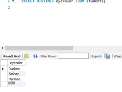

### D. Hae opiskelijoiden suku- ja etunimet, silmien väri ja tulot (incomes): incomes-sarakkeen otsikoksi pitää tulla Vuosipalkka.
 
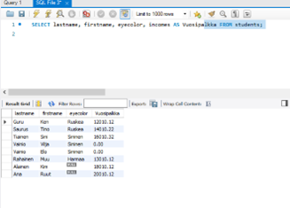

### E. Lajittele edellinen tehtävä ensijaisesti suku ja toissijaisesti etunimen mukaan kummatkin laskevassa järjestyksessä (käänteinen aakkosjärjestys).

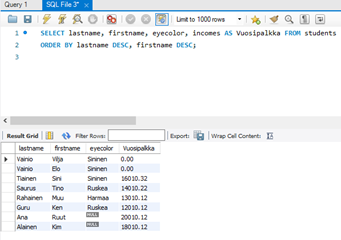

## Tehtävä 2 

### A.	Hae niiden opiskelijoiden suku- ja etunimet, joiden silmien väri on 'Sininen'.

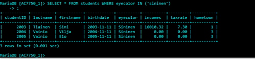

### B.	Listaa ne opiskelijat, joilla on pienemmät tulot kuin 14010.22? Hae nimet ja tulot.

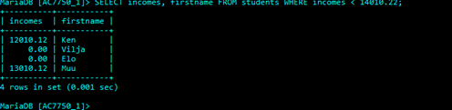

### C.	Listaa ne opiskelijat, joilla on pienemmät tai yhtäsuuret tulot kuin 14010.22? Hae nimet ja tulot. Lajittele palkan mukaan laskevasti.
 
 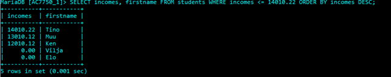
 
### D.	Hae ne turkulaiset (hometown = 1) opiskelijat, joiden silmien väri on 'Sininen'. Tulosta sarakkeet studentID, lastname, firstname, eyecolor ja hometown (kokonaisluku)

 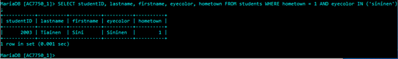
 
### E.	Listaa kaikki turkulaiset opiskelijat ja heidän lisäksi kaikki silmien väriltään harmaat. Tulosta kaikki sarakkeet.
 
 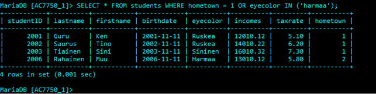

## Tehtävä 3 

### A.	Hae kaikki sarakkeet opiskelijoista, joiden veroprosentti (taxrate) ei ole 0.00

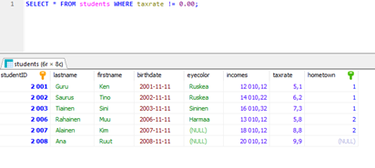

### B.	Hae turkulaisista tai tamperelaisista opiskelijoista ne, joiden tulot ovat yli 14000.

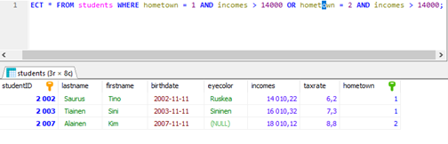

### C. Hae turkulaisista tai tamperelaisista opiskelijoista ne, joiden tulot ovat joko 12010.12 tai 18010.12
 
 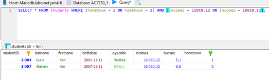
 
### D.Hae opiskelijat, joiden sukunimi alkaa A-kirjaimella.

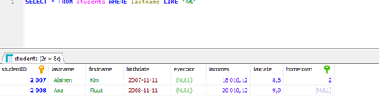

### E. Hae opiskelijat, joiden sukunimessä esiintyy merkkijono 'ai'

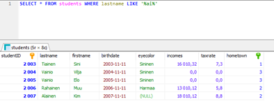

## Tehtävä 4 

### A.	Hae opiskelijat, joiden sukunimen toinen merkki ei ole a.
 
 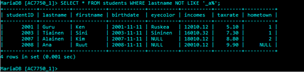

### B.	Hae opiskelijat, joiden veroprosentti on välillä 0.00 - 5.10 Lajittele veroprosentin mukaan. (Käytä BETWEEN-määrettä)
 
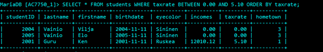

### C.	Hae opiskelijat, joiden veroprosentti on 0.00, 6.20 tai 7.30 (käytä IN-määrettä)
 
 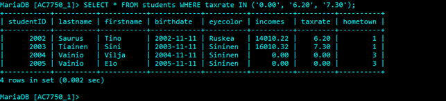
 
### D.	Hae opiskelijat, joiden kotikunta ei ole tiedossa (on NULL)
 
 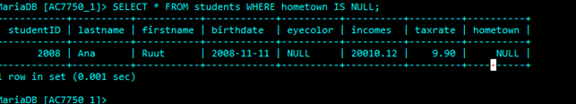
 
### E.	Hae opiskelijat, joiden silmien värin EI tiedetä olevan 'Sininen'.
 
 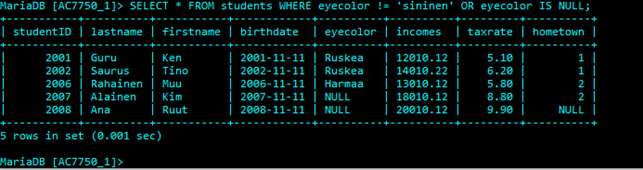

