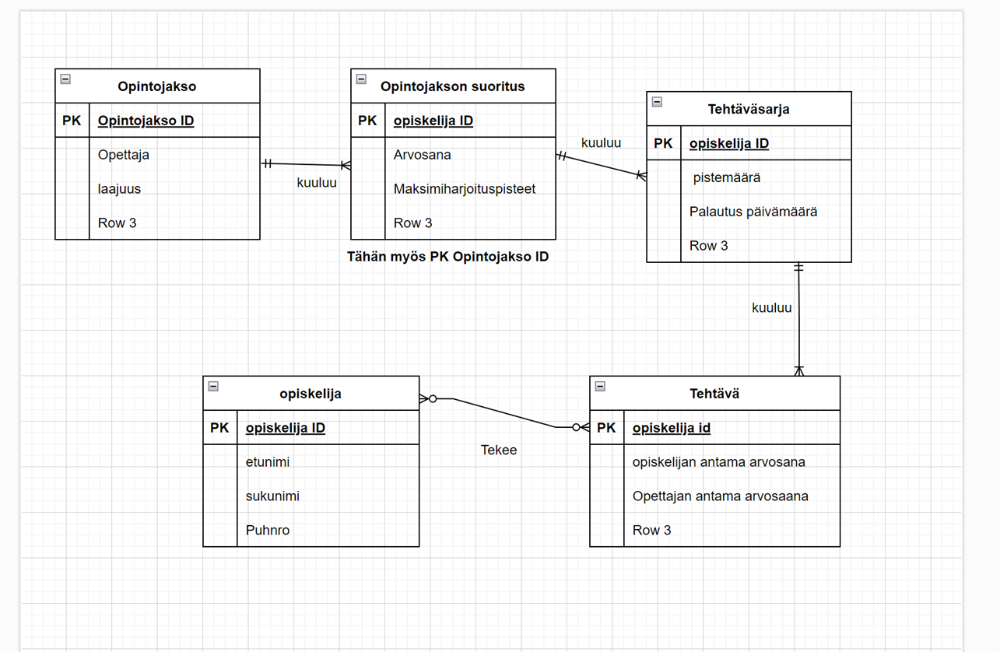
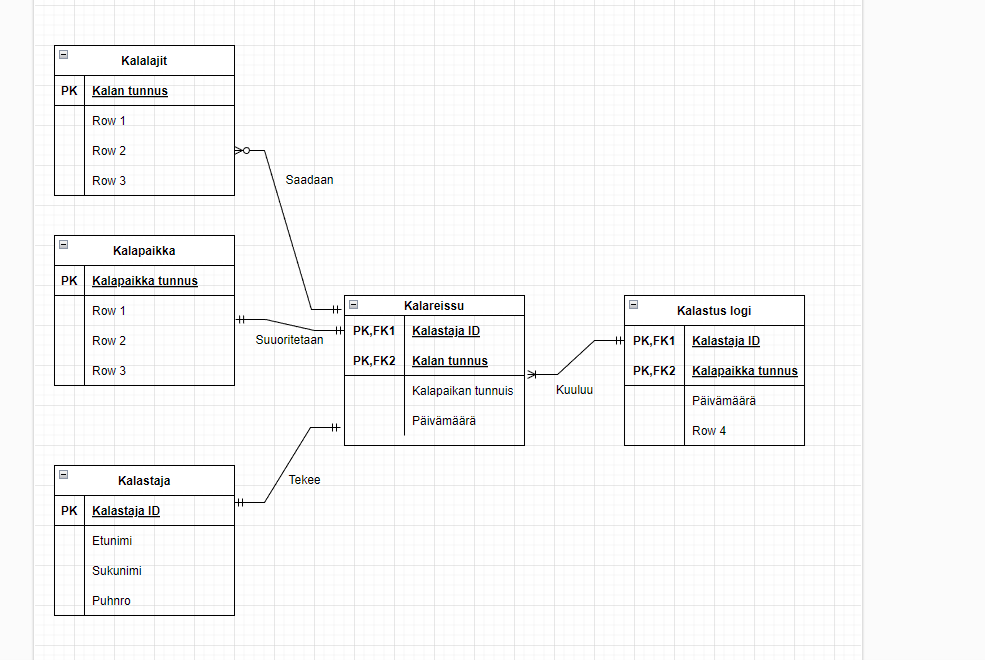

# Harjoitus3

### Tehtävä1

Suunnittele tietokantaratkaisu tämän opintojakson harjoitustehtävien palauttamiselle tarkoitetulle ScoreTronic-palvelulle. Opiskelijat palauttavat siis viikottain määrätyllä palautuspäivämäärällä kaikki tiettyyn (viikko)harjoitustehtäväsarjaan kuuluvat tehtävänsä. Harjoitustehtäväsarja koostuu useista harjoitustehtävistä mutta tietty harjoitustehtävä voi kuulua vain yhteen harjoitustehtäväsarjaan. Yksittäiselle harjoitustehtävälle on määritelty tehtävästä saatavat maksimipisteet. Palauttaessaan harjoitussarjaa opiskelija tekee jokaiselle tehtävälleen piste-ehdotuksen ja opettaja erikseen lopulta päättää opiskelijan saamat lopulliset tehtäväpisteet. Opiskelijasta tulee tietää ainakin opiskelijatunnus ja nimi.

Tietokantaratkaisun avulla järjestelmästä voidaan saada tietoja mm. eri opiskelijoista, heidän tehtäväpalautuksistaan: millaisia piste-ehdotuksia he ovat tehneet ja miten opettaja on pisteitä hyväksynyt. Lisäksi pitää pystyä laskemaan yhteenveto kuinka monta prosenttia kaikista opintojakson maksimiharjoituspisteitä opiskelijalle on hyväksytty.

Opiskelija
•	Tunnus (PK)
•	etunimi
•	sukunimi
•	puhnumero

Opintojaksot
opintojakso id (PK)
opettaja

Opintojakson suoritus
opiskelija id (PK)
Opintojakson id(PK)
maksimiharjoituspisteet
arvosana

Tehtäväsarja 
opintojakso id
tehtäväsarjan oppilaan pistearvio
palautuspäivämäärä
opettajan antama arvosana

Tehtävä
opiskelija id
opiskelijan pistearvio

## Tehtävä2 

Suunnittele tietokantaratkaisu, jossa tietoa tallennetaan kalastajista ja heidän eri kalapaikoissa kalastamista kalasaaleistaan. Tietoa on kyettävä tallentamaan myös saalistetuista kalalajeista.

Suunnittele tietokantaratkaisu siten, että jatkossa järjestelmästä voitaisiin saada ulos tietoja mm. eri kalastajista, heidän käyntilukumääristä eri kalapaikoissa, kalasaalismääristään, kalalajimääristään eri kalapaikoissa halutuilla aikaväleillä.

Tehtävän tuloksena on toimeksiantoon KT3 liittyvien käsitteiden ja niiden välisten yhteyksien graafinen esitys eli käsitemalli sisältäen käsitteiden ominaisuudet ja purettuna moni moneen -yhteydet.
Lisää syntyneseen käsitemalliisi keskeimmät (2-5kpl) käyttämäsi rajaukset ja pohdinnat tekstimuodossa tyyliin "kalareissu tehdään TASAN yhteen paikkaan" jne.

Tässä tehtävässä on tärkeämpää tehdä itse jokin ehdotus käsitemalliksi ja perustella se rajauksin ja pohdinnoin kuin yrittää tehdä täydellistä ratkaisua. Esim. lisää vain tärkeimmät vaaditut ominaisuudet jne.

EI PAKOLLINEN: Lisää malliisi merkinnät käsitteiden perus- ja viiteavaimille.

Kalastaja
ID (PK)
Etunimi
sukunimi

Kalapaikka
Kalapaikan tunnus

Kalareissu
Kalastaja ID
Kalapaikan tunnus
Päivämäärä

Kala
Kalastaja ID (PK)
nostopaikka
Laji
Nostopäivä

