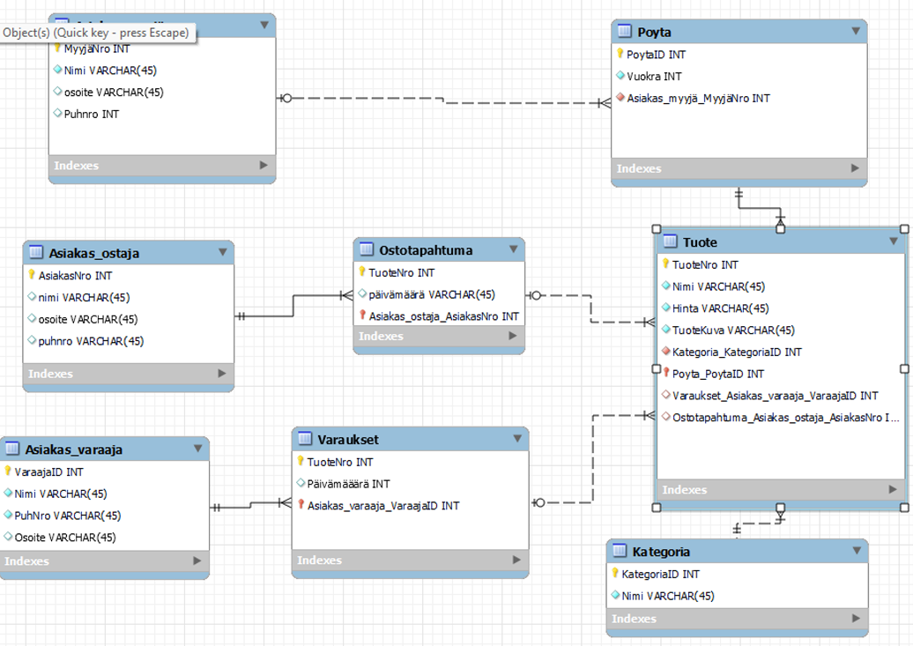
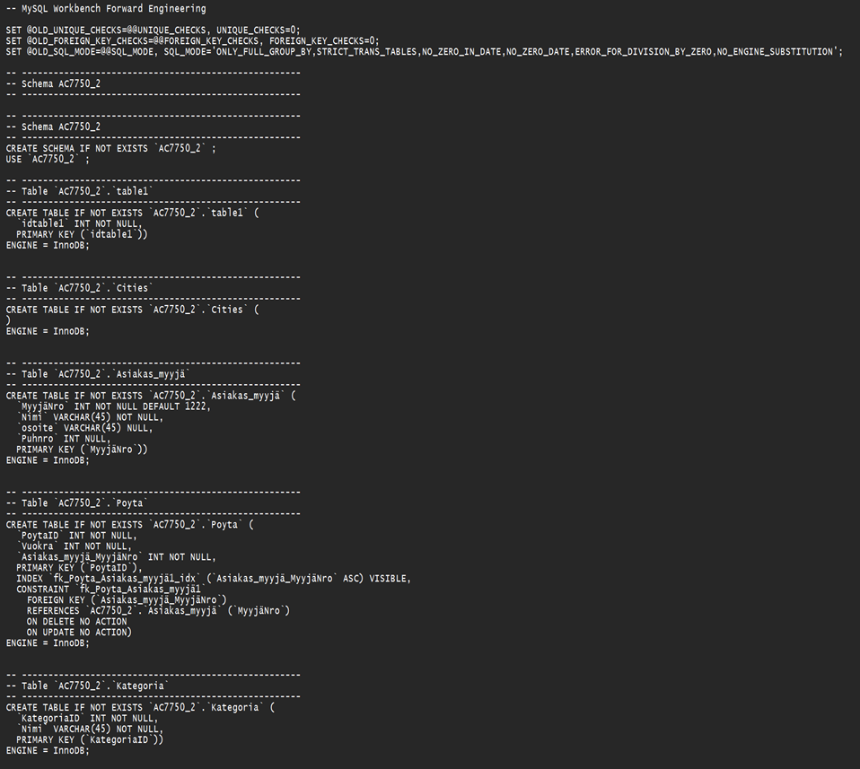
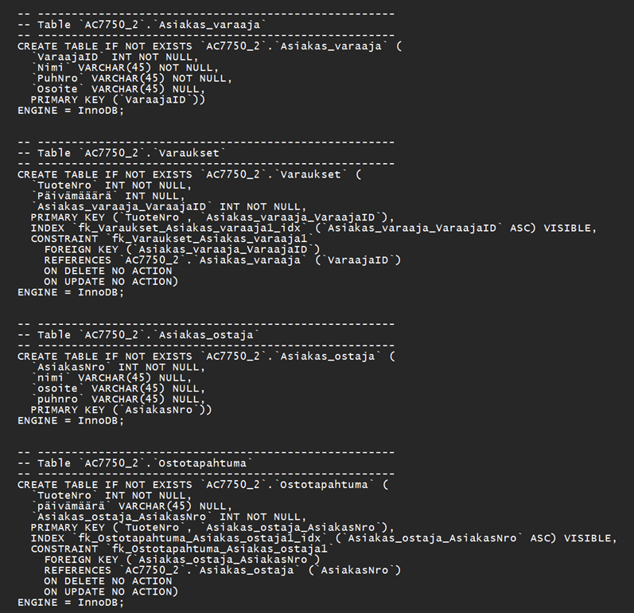
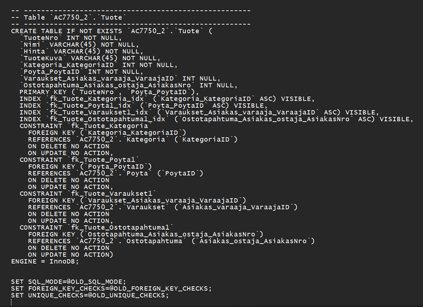
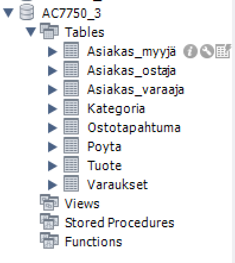

## Tietokannat harjoitus 4

### tehtävä1

Tehtäväsi on jalostaa Kirpputori-tietokannan yllä esitetystä käsitemallin luonnoksesta EER-kaavio MySQL WorkBench -ohjelmalla. EER-kaaviosi tulee täydentää ja tarkentaa yllä kuvattua toimeksiantoa ja käsitemallin luonnosta seuraavasti

Kaaviostasi tulee löytyä vähintään 6 eri taulua
Tarkenna ja tarvittaessa lisää tauluihin liittyviä tietoja (ominaisuuksia) edelleen siten, että ominaisuuksia on yhteen laskien vähintään 30kpl.
Voit nimetä taulut ja ominaisuudet halutessasi uudelleen (esim. englanniksikin)
EER-kaaviosi tulee kuvata myös kaikki tuotteen ja asiakkaan väliset yhteydet (myy/ostaa/varaa). Näin 6 taulun EER-kaaviosta tulisi löytyä lopulta vähintään 7; ehkä 8 eri yhteyttä.
Perustele keskeiset käyttämäsi ratkaisut, voit liittää perustelut ytimekkäinä lauseina tekstinä kaavioon tai muulla valitsemallasi tavalla
Tarkenna ja tarvittaessa muuta erityisesti käsitemalliluonnoksessa näkyviä alustavia yhteyksien lukumääräsuhteita (yksi-yhteen, yksi-moneen, moni-moneen) ja yhteyksien pakollisuuksia (esim. tuote on sijaittava aina tasan yhdellä pöydällä)
Voit toteuttaa tehtävänannosta halutessasi vain ne osat, jotka osaat tai saat aikaan mielekkäällä työmäärällä ja merkitä tehtävästä sitten osapisteitä.

### tehtävä2

Toteuta edellä määrittelemäsi tietokanta Workbenchillä haluamallesi tietokantapalvelimelle (esim. XAMPP, Mariadb.labranet.jamk.fi) Forward Engineer -toiminnolla. Osoita tekstein ja parilla/muutamalla kuvaruutukaappauksella, että onnistuit tietokannan luomaan. Lisäksi esitä Workbenchin generoimat SQL-lauseet tietokannan luomiseksi. Tietokantaan ei tarvitse lisätä dataa. Voit saada pisteitä tehtävästä vaikka et onnistu luomaan tietokantaa mallistasi. Tällöin esitä virheet ja mahdolliset pohdintasi/syyt virheille.

