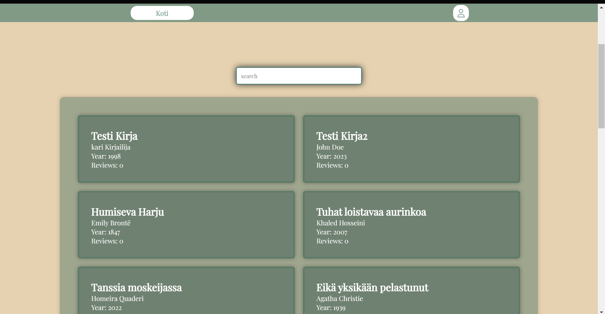
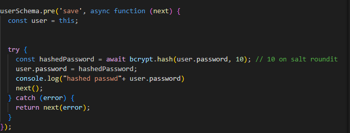
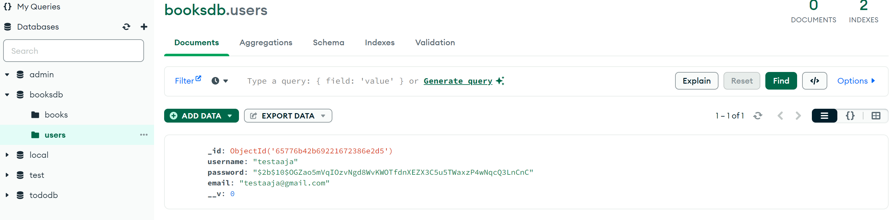
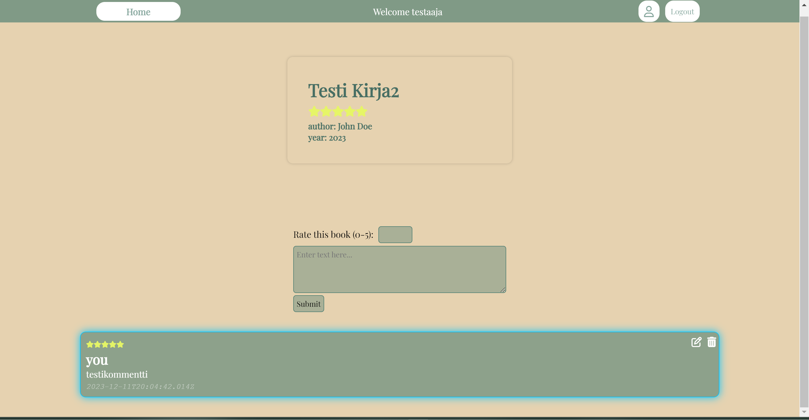
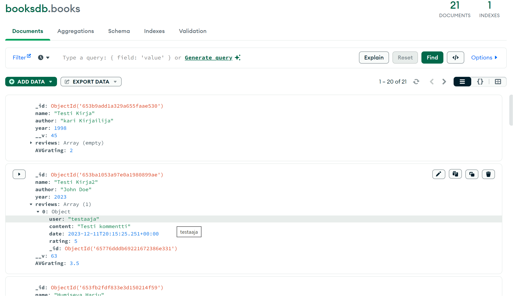

# Harjoitustyö  FullStack kurssille

# 28.10.2023

## Projektin suunnittelu ja hahmottelu 1h

Suunniteltu toteutettavan projektin käyttötarkoitus sekä hahmoteltu tarvittavia ominaisuuksia
Hahmoteltu paperille alustava ulkonäkö.

## Projektin aloitus 2h

Luotu alustava cli ja tietokanta mongodb:seen
Tehty alustavat endpointit backendiin, otettu käyttöön cors,mongoose sekä exxpress. 
otettu yhteys tietokantaan ja testattu toimivuus.
lisätty kirjoja tietokantaan. kirjalla tiedot nimi,kirjailija,julkaisuvuosi sekä reviews lista johon sisältyy arviointeja. arviointi tietoon sisältyy, arvioijan nimi, arvio(1-5) kommentti ja päivämäärä

# 29.10.2023

## Tiedon haku tietokannalta 2h

tehty js functio joka kutsuu get /books päätepistettä ja hakee kirjat.
Luotu funktio joka luo kirja elementit jokaiselle kirjalle ja lisää ne sivustolle
kesti hetki saada nuo gridiin miellyttävästi

## Muovattu ulkonäköä 30min

tehty jonkinlainen "logo" sivulle.
muovattu kirja elementtejä. vielä pitää muovata.

# 30.10.2023 

## Reviews sivu 2h

Tehty reviews.index tiedosto ja sille oma javascript tiedosto.
tehty  funktioita js tiedostoon jotka hakevat kirjan tiedot ja reviewit kutsumalla

## arvostelun jättö ominaisuus 1h

post methodi jolla kirjalle pystytään jättämään arvostelu

## ID:n välitys reviews sivulle 1h

ID:n välitys reviews js tiedostolle tapahtuu urlin kautta ainakin nyt alkuun, eli kun elementtiä klikataan (id atribuuteissa). 
Tallentuu id uuteen urliin josta sen saa napattua käyttöön ja näin syötettyä päätepisteelle /get methodia varten
ID:N haku rewies.js tiedostossa:

const urlParams = new URLSearchParams(window.location.search);
const bookId = urlParams.get("bookId");
const form = document.getElementById('usrform')

# 1.11.2023

## Haku ominaisuus etusivulle. 1.5h

Vertaa inputin arvoa listaan jossa kirjojen nimiä ja tulostsaa syötettä vastaavat nimet datalistiin hakupalkin alle

# 3.11.2023

## Koodin siistimistä 20min

poistettu turhaksi jääneitä funktioita, kuten fetchbook funktio ja searchbook
kommentoitu koodia muutenkin

## muokattu ulkonäköä 15min
vaihdettu värejä, lisätty elementteihin interaktiivisuutta. 

# 4.11.2023

## Haun muokkaus 2h
Lisätty kirjoja tietokantaan, muokattu kirjojen hakuehdotus ominaisuutta siten että hakua vastaavat kirjat tulostuvat datalistin sijaan bookgrid elementtiin, renderöimällä gridin elementit uudestaan ja tulostamalla vain hakua vastaavat kirjat.

# 8.11.2023

## Rating ominaisuus 1h

Luotu skeeman review osioon uusi osio, rating ja tehty html sivulle prototyyppi "tähditykseen". eli käyttäjä voi nyt jättää ratingin 1-5 kirjalle.
tehty kommenttiin elementti ratingille, tähän alustavasti tähdet unicodella, myöhemmin vaihdetaan iconeiksi.

## keskiarvon laskenta funktio 30min

alettu tukia miten saisi laskettua aina kirjan arvioiden keskiarvon.
Methodin käyttöä tutkittu ja kokeilin tehdä sen skeemaan.

# 9.11.2023

## keskirvon laskeminen ja display 1.5h

Methodin kutsumisen kanssa ongelmia mutta sain toimimaan. 
tein skeemaan osan keskiarvolle ja liitin reviewsien post päätepisteeseen osan
book.AVGrating = book.calculateAverageRating(book.reviews)
joka aina postauksen yhteydessä laskee uuden keskiarvon kirjalle.
Tämän jälkeen kopioin melkein suoraan reviewsien tähtien display ominaisuuden kirjan info elementtiin.

## 

# 10.11.2023

## Käyttäjän rekisteröinti ja salasanan hashaus 2.5h

ensin käyttäjä scheman luonti, tein tällä kertaa erilliseen tiedostoon kokeillakseni miten se tapahtuu, tämän jälkeen tein post methodin käyttäjän välitykselle tietokantaan. Schema sisältää käyttäjänimen,salasanan sekä emailin. tämän jälkeen aloin lueskelemaan bcryptin käytöstä. Löysin tavan jolla salasanan hashaus tapahtuu save:n yhteydessä: userSchema.pre.

tämä onnistui yllättävän hyvin, testattu postmanilla toimivuus ja tehty pari testi käyttäjää, hashausta varten käytössä bcrypt

## Rekisteröinti popup ikkuna 0.5h

# 12.11.2023

## /register post reitin kutsuminen js funktiolla 1h
Tähän tehty funktio script.js tiedostoon joka kutsuu post reittiä. tähän lisättävä oikeat virhe viestit 

## routet ja schemat omiin kansioihin 2h
Sain vinkkiä että kannattaisi laittaa routet sekä schemat omaan kansioon ja omiin filuihin joten lähdin toteuttamaan.
Nyt index tiedosto näyttää nätimmältä ja kokonaisuutta on helpompi muokata.

# 14.11.2023

## authentikointi schema 1.5h

tätä varten ladattu @hapi/joi
luotu file kanisoon helps johon tehty authSchema, tämä on ns viitemalli mitä scheman tietojen tulee pitää sisällään. Passwordiin 
saisi vaikka että pitää sisältää isoja ja pieniä kirjaimia sekä numeroita. 
otettu myös käytöön .env tiedosto. tätävarten ladattu dotenv.

## Tokenit 1h

Asennettu JWT(jsonwebtoken). jwt_helper file luotu helps kansioon. Funktiolla signAccessToken voimme nyt lisätä käyttäjille luonnin yhteydessä access tokenin

# 18.11.2023

## sisäänkirjautuminen 2h

tehty login route ja authenticountiin liittyvät funktiot
nyt login route palauttaa acesstokenin sekä käyttäjänimen jotta ne voi tallentaa localstorageen sivuston käyttöä varten.

## kommentointi ominaisuuden päivittäminen 1h

nyt kommenttiin ei tarvitse laittaa enää omaa nimimerkkiä vaan sivusto hakee automattisesti kirjautuneen käyttäjän nimen. vielä pitää sen verran päivittää että kommenttia ei voi jättää ilman sisäänkirjautumista. Eli jos yrittää kommentoida ilman että on kirjautunut niin sivusto aukaisee popup kirjautumis formin

# 22.11.2023

## kommentointi ja authentikointi 3h

Päivitetty kommentointi ominaisuutta siten ettei pysty jättämään kommenttia jos ei ole kirjautunut. kirjautuminen varmistetaan sivuston auetessa ja riippuen sisäänkirjautumisesta niin kommentointi kenttä on joko piilotettu tai näkyvissä. Nyt myös omat kommentit näkyvät erilaisina, mikäli käyttäjä on kirjautunut ja kommentoinut niin kommentin reunat "hohtavat"

kommentti tietokannassa:

## edit ja poisto 1h

mikäli kommentin jättäjä on kirjautunut sivustolle. kommenttiin tehdään edit ja poisto napit

## poisto funtkio 1h

otettu mallia harjoituksesta 8 ja muokattu poisto funktio ja reitti tähän työhön soveltuvaksi. Kommentin poistaessa sivu päivittää kommentit heti. Ennen poistoa sivusto lähettää alertin että suoritetaanko varmasti poisto.

# 30.11.2023

## edit funktio 1h

editointi funktioon myös otettu mallia harjoitus 8. Tällä hetkelä editointi funktio ei tosin toimi halutulla tavalla vaan editoidessa luodaan jostain syystä uusi kommentti eikä muokata olemassa olevaa.

tämä ongelma ilmeisesti johtuu siitä että nappiin on lisätty eventlistenerillä post methodi. Eli nappi kutsuu sekä edit ja postaus funktioita jonka takia kommentista tulee duplikaatti. siirtämällä js kutsun html:lään onclickiksi. tämän jälkeeen edit toiminto toimi hyvin.

# 1.12.2023

## sivun ulkoasun muokkausta 1h

kokeillaan toista värimaailmaa, beige ja joku luonnon vihreä, esim vaalea metsän vihreä tms

