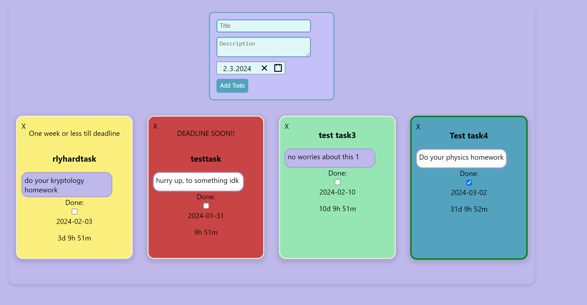

# Todo app with mern stack

## Features right now

### deadline tracking

### working routes for deletion, adding, completion/editing

### colors change if dealine is 1 week from now, tomorrow, or late. also completed has different colour

## upcoming features list

### editing todos description

### done class will cross the todo over

### filtering todos according to deadline

### better todo boxes and prettier colors :D

### you can create a ul for each day. then the ul contains todo/deadline cards, you can drag and drop the cards 