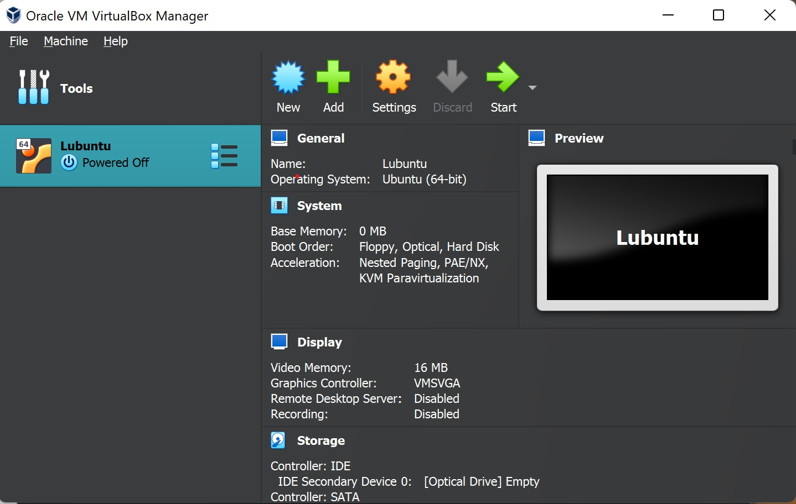
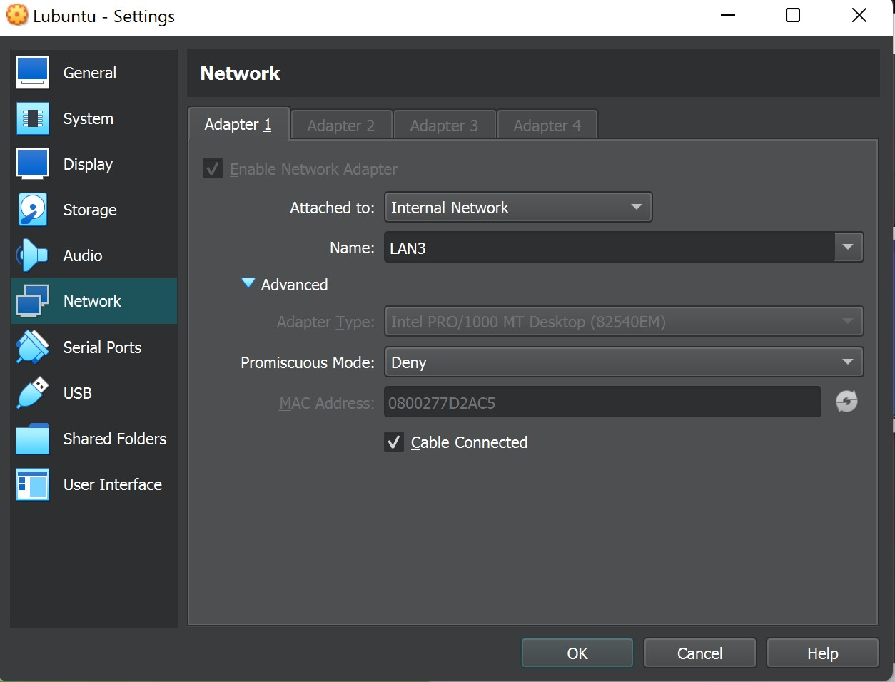
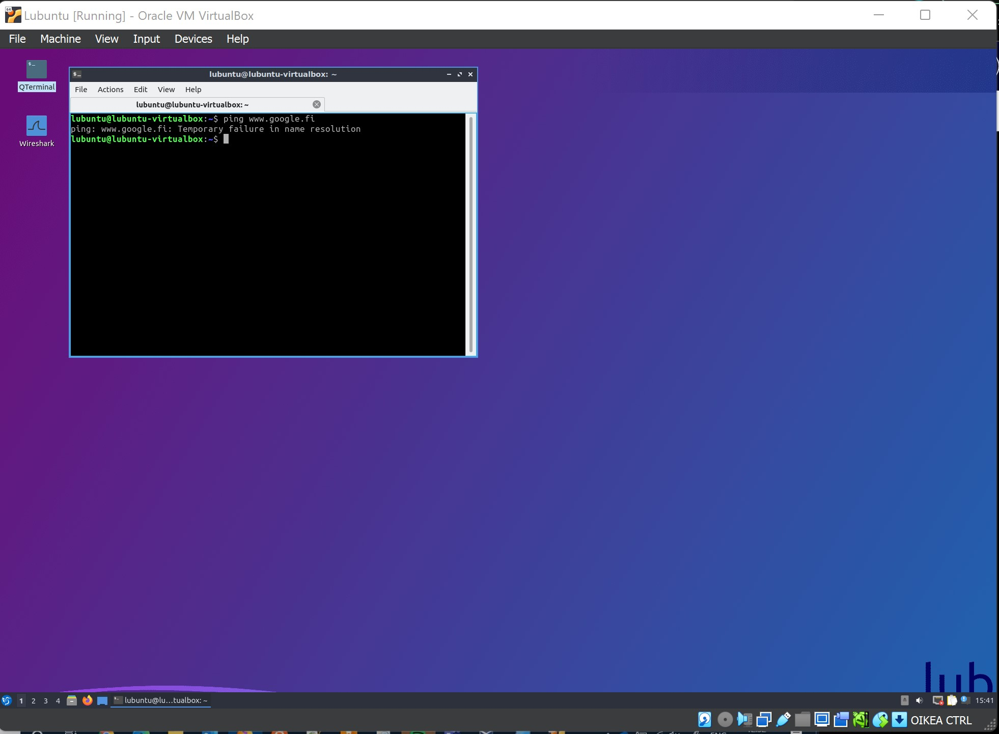
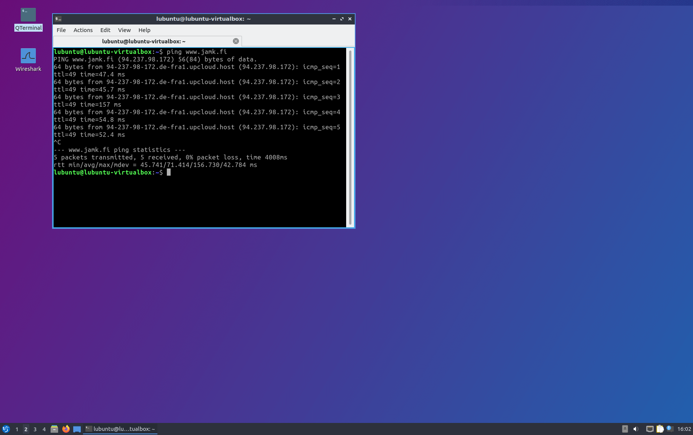
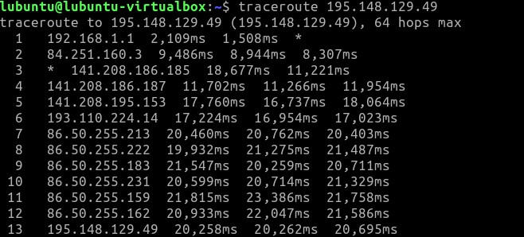
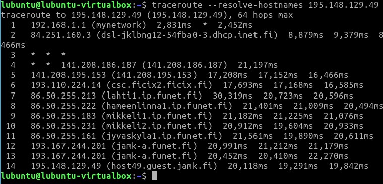
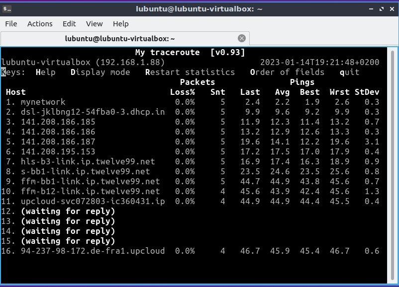
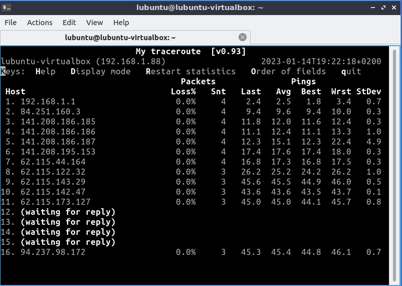

# Documentation for E01

Start here...
 
Tässä kuvaa rakenteesta omalla läppärillä. Ja ikäväkyllä
wlani käytössä tällä hetkellä.

 
Tässä sc luodusta lubuntu koneesta.(huomasin että base memory oli 0, vaihdoin siihen 1024MB)

 
Kuva virtuaalikoneen verkkoasetuksista.

Kuva virtuaalikoneesta auki, ei verkkoa

 
Mihin tätä virtuaalikonetta voi käyttää ilman verkkoyhteyttä? Mitä voit tehdä sillä?

 
Eipä silä ihan hirveästi voi tehdä. Itse tietokonetta voi toki ohjelmoida tekemään asioita.

 
Onko tietokoneilla mitään tarkoitusta ilman yhteyttä tietoverkkoon?
Riippuu vähän mitä tietokoneeseen on asennettuna ja mitä voi käyttää ilman verkkoa.
Kyllähän sillä ohjelmoida voi tietyissä määrin esimerkiksi jos on tarvittavat asiat asennettuna.
Voi tietokoneella ratkoa erilaisia ongelmia ja esimerkiksi matemaattisia pulmia.
 
Vaihdettu yhteys bridged adapderiin
 
Tässä ping tulokset

Tässä traceroute tulokset
 

 
resolve-hostnames tulokset
 

 
Sc sekä mtr ja mtr -n komennoista..
 

