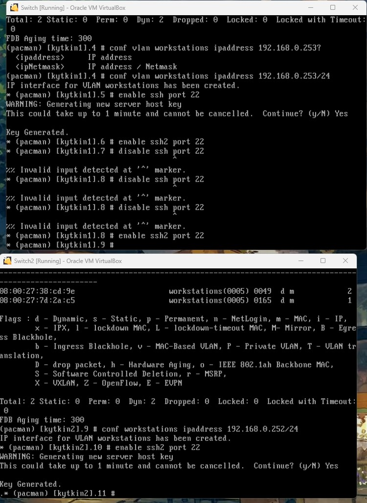

# Documentation for E02

Start here...

Kytkinten konfiguraatiot

* [Switch1](/E02/Switch.cfg)
 
Tässä töherrystä aiheesta mitä ruvetaan tekemään.

Luoto ensimmäinen switchi ja kopioitu se, tässä asetuksista sc
 

 
Kloonatessa täytyy muistaa valita että generoidaan uusi mac osoite.
 
Lubuntu koneet vaihdoin myös internal networkkiin ja 1 koneella LAN1 ja lubuntu2 LAN3
 

 
enabloidaan portit 1-2 molemmilla switcheillä. ja hyvältähän ne näyttää.

 
löin päälle molemmat lubuntut ja rupesi läppäri hieman jo kehräämään :)
 
kävin laittamassa kummankin lubuntun netti asetukset kuntoon
 
Ping tulokset:

 
ja tässä show fdb tulokset kun lubuntu pingaa toista lubuntua

 
Tällä hetkellä tilanne siis tämä

loin ja conffasin VLAN:T, en tosin jättänyt pingiä päälle tämän ajaksi mutta toimi ainakin kun olin muutokset tehnyt.
 

 
Tein lubuntu wiresharkin ohjeiden mukaan.
 

 
Seurasin lubuntujen välistä pingiä.
 

 
Wireshark capturen rivien tutkiminen: 

 
Kuvat ethernet kehyksen kuormasta
 

 
Tuli vähän taka pakkia kun oma kone oli rikki tuossa välissä niin pitä tehdä koulun koneella tähän asti ja nyt omalla koneella kuroa kiinni.
 
Omalla koneella jouduin asentamaan oracle vm:n
 
enabloin vahingossa switch1:llä ssh1 portin. mutta ssh toimi kumminkin lubuntulla.

 
# lubuntu 1 kytketty kytkin 2
 
 Module devmgr configuration.                                                   
                                                                              
configure snmp sysName "[kytkin2]"                                               
configure snmp sysContact "https://www.extremenetworks.com/support/"             
configure sys-recovery-level switch reset                                        
                                                                                 
#                                                                               
 Module vlan configuration.                                                     
                                                                             
configure vlan default delete ports all                                          
configure vr VR-Default delete ports 1-2                                         
configure vr VR-Default add ports 1-2                                            
configure vlan default delete ports 1-2                                          
create vlan "workstations"
configure vlan workstations tag 5
configure vlan workstations add ports 1 tagged  
configure vlan workstations add ports 2 untagged  
configure vlan workstations ipaddress 192.168.0.252 255.255.255.0

 Module mcmgr configuration.

 Module otm configuration.

Module fdb configuration.

 
# lubuntu2 kytketty kytkin1
#
 
xtremeXOS
Copyright (C) 1996-2020 Extreme Networks. All rights reserved.
This product is protected by one or more US patents listed at https://www.extremenetworks.com/company/legal/patents/ along with their foreign counterparts.
==============================================================================

Press the <tab> or '?' key at any time for completions.
Remember to save your configuration changes.

(pacman) [kytkin1].1 # show configuration

 Module devmgr configuration.

configure snmp sysName "[kytkin1]"
configure snmp sysContact "https://www.extremenetworks.com/support/"
configure sys-recovery-level switch reset

Module vlan configuration.

configure vlan default delete ports all
configure vr VR-Default delete ports 1-2
configure vr VR-Default add ports 1-2
configure vlan default delete ports 1-2
create vlan "workstations"
configure vlan workstations tag 5
configure vlan workstations add ports 2 tagged  
configure vlan workstations add ports 1 untagged  
configure vlan workstations ipaddress 192.168.0.253 255.255.255.0

 Module mcmgr configuration.

