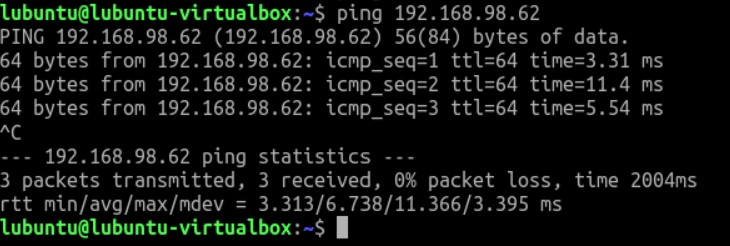
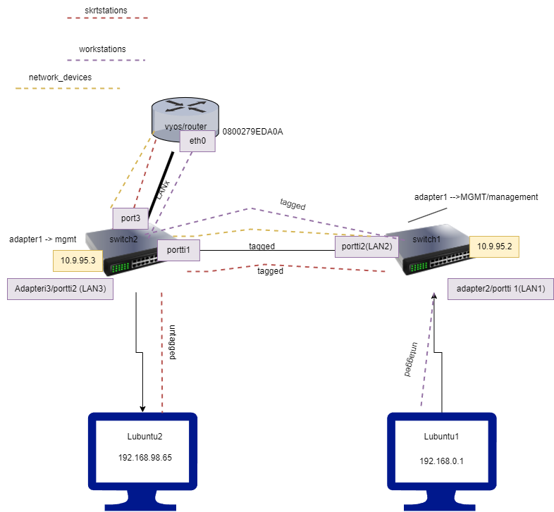

# Documentation for E04

Start here...
### T1

Tehdään virtuaali kone vyos 

Tehdään ns uusi "kaapeli" 2 swicthiin. nimetään tämä lanx:si

otetaan switch2 käyttöön 4adapteri ja laitetaan se LANx:ään

adapter4 on nyt port3

valitut kaksi aliverkkoa 192.168.98.0-192.168.98.63,

sekä 198.168.98.64-192.168.98.127

ja 13 osoitteen verkoista valitsin.

10.09.95.96/28

nyt tagailty portteja switcheissä, ja tehty vlan nimieltä "skrtstations"

switch2 :configure vlan tag 6, add ports 1,3 tagged,

switch1: configure vlan skrtstations tag 6, add ports 2 tagged,

tökitään komennot routerille eth0:llaan

tässä huomasin että oli typo conffeissa 192.168.98.126 oli 192.162.

huomasin vasta kun pingailin lubuntulla, mutta kävin sitten korjaamassa

Nyt pitäisi olla switchien portit tägätty oikein eli 2 switch portit 2,3 tagged ja ykkösessä portti 2 tagged

 

koska se oli jo olemassa, taisin olla aiemmin vahingossa luonut

kyseisen interfacen ilman ip:tä, en saanut sitä millään poistettua

löysin kuitenkin kyseisen komennon jolla sen vihdoin sain poistettua

### sudo ip link delete dev eth2.102

commit ja lopputulos:

### Kytkimillä

configure iproute add default "network_devices rajapinnan ip"

Pingit kokeiltu molemmilla lubuntuilla mutta tässä kuvat lubuntu1 pingeistä

ping toiseen lubuntuun 

ping omaan verkkorajapintaan 

ping switch1 

switch2

traceroute

### Topologia tässävaiheessa

### lubuntu2 ssh --> vyos

