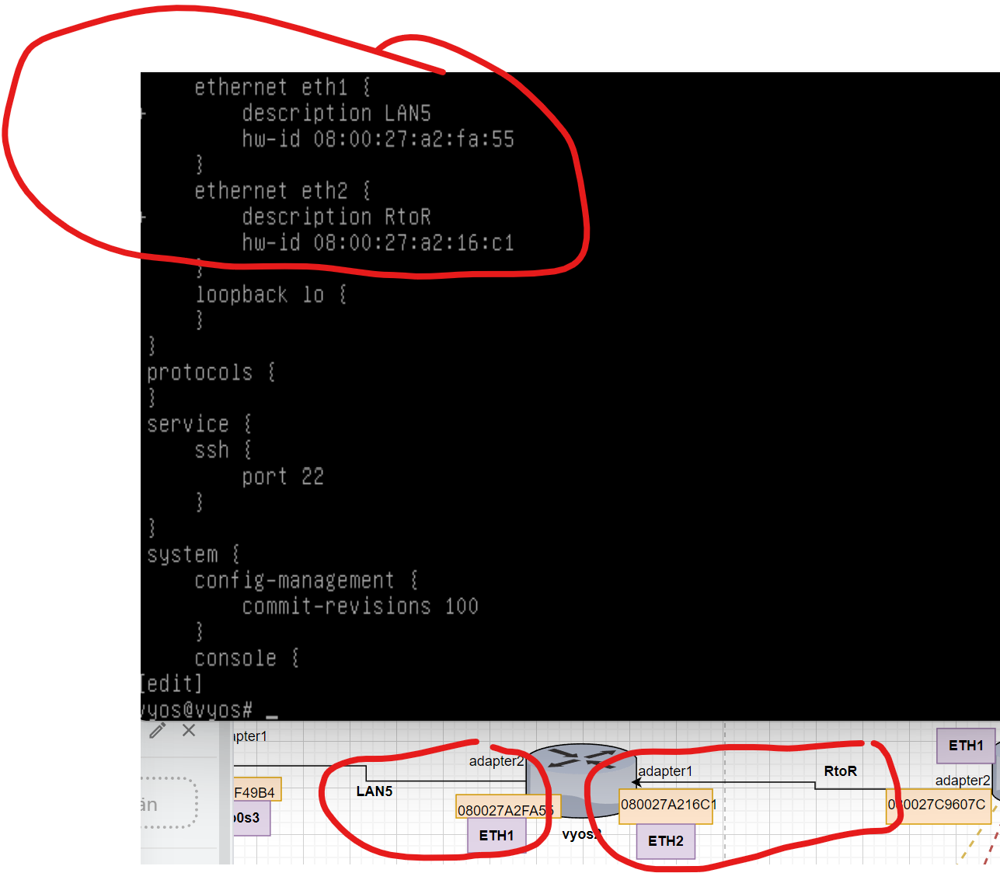

# Documentation for E05

### harjoitus 5

Tehtiin virtuaalikoneet vyos2 sekä  subuntu 3

kytkettiin "kaapelit" kyseisellä tavalla:

Lubuntu3 adapteri 1 LAN5:seen

Vyos2 adapteri 1 RtoR:ään ja adapteri 2 LAN5:seen

Vyos 1 adapteri 2 RtoR:ään

Vyos 1 toiseksi eth rajapinnaksi eth1

vyos1 konffauksia:

vyos2 konffauksia

Itsellä menee eth1 LAN 5:seen ja eth2 RtoR:ään

ip osoitteet vyoseilla rajapinnoilla. vyos1 eth1 ip 10.9.95.241/30

vyos 2:lla eth1 192.168.98.129/26

eth2 10.9.95.242/30

### tämän hetken topologiat..

## laitteiden osoittestaminen DHCP reirittimillä

### 1. Lisää ja dokumentoi DHCP palvelin(konfiguraatio) R1:ssä kiinni oleville aliverkoille (paitsi network_devices).

### Vyos1: conffit vlanille: workstation 192.168.98.0/26

set service dhcp-server shared-network-name VLAN5 subnet 192.168.98.0/26 default-router 192.168.98.62

set service dhcp-server shared-network-name VLAN5 subnet 192.168.98.0/26 range PCs start 192.168.98.1 

set service dhcp-server shared-network-name VLAN5 subnet 192.168.98.0/26 range PCs stop 192.168.98.50

## Vyos1: conffit vlanille: skrtstations 192.168.98.64/26s

set service dhcp-server shared-network-name VLAN6 subnet 192.168.98.64/26 default-router 192.168.98.126

set service dhcp-server shared-network-name VLAN6 subnet 192.168.98.64/26 range PCs start 192.168.98.65

set service dhcp-server shared-network-name VLAN6 subnet 192.168.98.64/26 range PCs stop 192.168.98.115

### 2. Tee sama R2:lle (ja siinä kiinni olevalle työasemaverkolle)
## Huom! R2:sen ja Lubuntu3:n välissä ei ole kytkintä eli niiden adapterit voivat olla samassa Internal Network:ssä VirtualBox:ssa

# Vyos2: conffit vlanille: skrtstations 192.168.98.128/26

set service dhcp-server shared-network-name LAN5 subnet 192.168.98.128/26 default-router 192.168.98.129

set service dhcp-server shared-network-name LAN5 subnet 192.168.98.128/26 range PCs start 192.168.98.130

set service dhcp-server shared-network-name LAN5 subnet 192.168.98.128/26 range PCs stop 192.168.98.180

##Lainat (eng. Leases)

##Dokumentoi show dhcp server leases -komento R1:ltä ja R2:lta kun DHCP on alkanut toimimaan.

### Vyos1 dgcp server lease

Vain lubuntu 1 käynnissä.

###Vyos2: dhcp server lease.

## Luodaan staattinen reitti reitittimille

### Toteuta symmetrinen reititys R1 ja R2 välillä.

### syötetyt komennot vyos1:

###set protocols static route 192.168.98.128/26 next-hop 10.9.95.242

### syötetyt komennot vyos2:

###set protocols static route 192.168.98.0/26 next-hop 10.9.95.241

tein myös stattisen reitin    192.168.98.64/26 

##yhteyksien testausta

###traceroute lubuntu1 - lubuntu3

###traceroute lubuntu3 - lubuntu1

