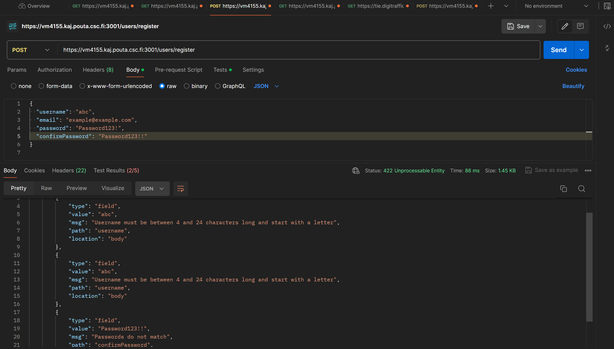

# Tukko 2.0

# about this project

this project was a part of future factory 2024 project, and was done in a team of 6 people. The goal was to implement features to Tukko traffic visualization app created by IOTitude for CombiTech during WimmaLab.

# What i learned during this project

I was assigned the role of the team lead and i mainly took care of the scheduling and project management and learned alot about management process of app development, scrum and agile. I also wanted to be a part of the development and operations processes, as this was a great opportunity to learn.

During this project i worked with developing different features wich i will open more underneath.
Also got valuable excperience on working with a bigger project, version control, teamwork, gitlab runners and security testing etc.

## Stack:

### Typescript

### React

### Nodejs

### MongoDB

### Redis

### VUE js

### Docker

# Stuff and Features i worked on, and what i did

## Team Page

i created a simple team introducion page using reactjs and got it running using a gitlab runner

https://it-ff-2024-t13.pages.labranet.jamk.fi/site/

## Secure user authentication

This feature included user registeration, login, logout, session management, password hashing and secure storing of user information.

i was mostly focusing on the backend side of this feature, and my team member took care of the frontend components and api calls.

I started by creating the user schemas and a .pre action to hash the password using Bcrypt.

```javascript
import express from "express";
import { NextFunction, Request, Response } from "express";
import { StatusCodes } from "http-status-codes";
/*import { UserModel } from "../../models/User_data_model"; // Import the User model*/
import { insertUserToMongo } from "../scripts/saveToMongo";
import { User, Usertype } from "../models/User_data_model";
import { Module } from "module";
import { collections } from "../scripts/mongo";

import * as Usercontroller from "../controllers/usercontrols";
import * as mongoDB from "mongodb";
export const users = express.Router();
users.use(express.json());

declare module "express-session" {
  interface SessionData {
    username: string; // Define username property
    email: string; // Define email property
    userId: string;
  }
}

users.post("/logout", (req, res) => {
  // Destroy the session to log out the user
  req.session.destroy((err) => {
    if (err) {
      console.error("Error destroying session:", err);
      return res.status(500).json({ message: "Logout failed" });
    }
    // Session destroyed successfully
    res.cookie("CookieName", "", { expires: new Date(0) });
    res.status(200).json({ message: "Logout successful" });
  });
});

// register endpoint
users.post("/register", Usercontroller.signUp);

// Login endpoint
users.post("/login", Usercontroller.login);


users.get("/checkAuth", Usercontroller.getAuthencitatedUser);

users.get("/user/:id", async (req: Request, res: Response) => {
  try {
    //res.status(200).json({ message: 'Hello' });
    const userId = req.params.id;
    const user = await collections.users?.findOne({ userId });
    console.log(user);
    res.status(200).json(user);
  } catch (error) {
    console.error("Error:", error);
    res.status(500).json({ error: "Internal server error" });
  }
});
users.get("/users", async (req: Request, res: Response) => {
  try {
    // Fetch users from MongoDB
    const users = await Usertype.find().exec();
    console.log("käyttäjät", users);

    // Send the users as a response
    res.status(200).json(users);
  } catch (error) {
    console.error("Error fetching users:", error);
    res.status(500).json({ error: "Internal Server Error" });
  }
});
users.use((err: any, req: Request, res: Response, next: NextFunction) => {
  console.error(err);
  const statusCode = err.statusCode || StatusCodes.INTERNAL_SERVER_ERROR;
  res.setHeader("Content-Type", "application/json");
  const errorResponse = {
    statusCode: statusCode,
    error: statusCode === 500 ? "Internal Server Error" : err.error,
    message: err.message,
  };
  res.status(statusCode).json(errorResponse);
});

```

Then i created api routes for login, register and logout and created a function for connection to mongodbs user collection. Also added a error handling middleware and a route to check authentication

```js

import * as Usercontroller from "../controllers/usercontrols";

declare module "express-session" {
  interface SessionData {
    username: string;
    email: string;
    userId: string;
  }
}

users.post("/logout", (req, res) => {
  // Destroy the session to log out the user
  req.session.destroy((err) => {
    if (err) {
      console.error("Error destroying session:", err);
      return res.status(500).json({ message: "Logout failed" });
    }
    // Session destroyed successfully
    res.cookie("CookieName", "", { expires: new Date(0) });
    res.status(200).json({ message: "Logout successful" });
  });
});

// register endpoint
users.post("/register", Usercontroller.signUp);

// Login endpoint
users.post("/login", Usercontroller.login);


users.get("/checkAuth", Usercontroller.getAuthencitatedUser);


users.use((err: any, req: Request, res: Response, next: NextFunction) => {
  console.error(err);
  const statusCode = err.statusCode || StatusCodes.INTERNAL_SERVER_ERROR;
  res.setHeader("Content-Type", "application/json");
  const errorResponse = {
    statusCode: statusCode,
    error: statusCode === 500 ? "Internal Server Error" : err.error,
    message: err.message,
  };
  res.status(statusCode).json(errorResponse);
});

```

During login i wanted to use session management with express-session and redis store.
I got the cookie working with :

```js
export const login: RequestHandler<
  unknown,
  unknown,
  LoginBody,
  unknown
> = async (req, res, next) => {
  const username = req.body.username;
  const password = req.body.password;

  try {
    if (!username || !password) {
      throw createHttpError(400, "parameters missing");
    }
    const existingUser = await Usertype.findOne({ username: username });
    if (existingUser) {
      // use the validPassword method to compare passwords
      const isvalid = await existingUser.validPassword(password);
      if (isvalid) {
        req.session.username = existingUser.username;
        req.session.email = existingUser.email;
        console.log("loginroute: session", req.session);
        console.log("logged in:", existingUser.username, existingUser.email);
        return res.status(200).json({ Message: "succesfull login" });
      } else {
        res.status(400).json({ error: "invalid credentials!" });
      }
    } else {
      throw createHttpError(401, "invalid credentials!");
    }
  } catch (error) {}
};
```

and session establishing:

```js
onst sessionSecret = process.env.SESSION_SECRET;
if (!sessionSecret) {
  console.error("SESSION_SECRET not found in .env file");
  process.exit(1); // Exit the process if secret key is missing
}
const RedisStore = require("connect-redis").default;

app.use(
  session({
    name: 'CookieName', // Määritä evästeen nimi tässä
    store: new RedisStore({
      client: client,
    }),
    secret: sessionSecret,
    resave: false,
    saveUninitialized: false,
    cookie: {
      secure: true, // true because HTTPS
      maxAge: 24 * 60 * 60 * 1000, // 1 day
    },
  })
);
```

This seemed to work fine with postman and logout function also worked but i ran into a problem on the browser, as it didnt seem to remove the users cookie

fixed this by adding

```js
   cookie: {
      secure: true, // true because HTTPS
      maxAge: 24 * 60 * 60 * 1000, // 1 day
      httpOnly: true, // Prevent client-side script access
    },
```

After these i also wanted to throw the right error messages to the users so i implemented some error handling to the frontside.

also here is the user schema models and pre save method to crypt the passwd:

```js
import { ObjectId } from "mongodb";
import { InferSchemaType, Document, Model, model, Schema } from "mongoose";
import bcrypt from "bcrypt";
import { Station } from "./tms_data_model";

export interface User extends Document {
  username: string;
  email: string;
  password: string;
  favorites: string[];
  validPassword: (password: string) => boolean;
}
interface UserMethods {
  password: string;
}
type UserModel = Model<User, {}, UserMethods>;

const userSchema =
  new Schema() <
  User >
  {
    username: { type: String, required: true, unique: true },
    email: { type: String, required: true, unique: true },
    password: { type: String, required: true },
    favorites: [{ type: String }], // Store station IDs as strings
  };

userSchema.pre("save", async function (next) {
  if (!this.isModified("password")) {
    return next(); // If the password is not modified, move on
  }
  try {
    // Generate a salt
    const salt = await bcrypt.genSalt(10);
    // Hash the password with the salt :)
    const hashedPassword = await bcrypt.hash(this.password, salt);
    // replace with hashed
    this.password = hashedPassword;
    next();
  } catch (error) {
    throw error;
  }
});
// password comparison
userSchema.method(
  "validPassword",
  async function validPassword(password: string): Promise<boolean> {
    try {
      console.log("compared passwd", password);
      console.log("saved passwd", this.password);
      const valid = await bcrypt.compare(password, this.password);
      console.log("valid?", valid);
      return valid;
    } catch (error) {
      throw error;
    }
  }
);

export const Usertype = model < User > ("User", userSchema, "users");
```

# HTTPS protocol

Our teams operations wizard started with this and got it working on the frontend, we ran into a problem as the backend needed a https cert aswell.
I decided to hop into this on my freetime, because it seemed pretty interesting.
I then copied the same cert to the backend as they were running on the same domain and configured the https connection :

```js
const https = require("https");
const options = {
  key: fs.readFileSync("./certs/privkey.pem"),
  cert: fs.readFileSync("./certs/cert.pem"),
  ca: fs.readFileSync("./certs/fullchain.pem"),
};

const httpsServer = https.createServer(options, app);
httpsServer.listen(port, () => {
  console.log(`Server running on HTTPS port ${port}`);
});
```

and modified the dockerfile to copy the certs to the container.
After this i changed the frontend api calls to be made to the https endpoint and volá it works.

# Securing Api endpoints

On this section i will list some actions taken to secure our applications api endpoints.

## CORS (Cross-Origin Resource Sharing)

CORS policies configured to restrict domains that can access the endpoints.

## Security Headers

Confiured security headers using Helmet library

## Rate limiting

configured rate limiters to limit the number pf requests client can make

## HTTPS

as mentioned before, configured https to encrypt data transmitted betveen clients and server to prevent unauthorized access and data interception

## Input validation

Used express-validatior to implement input validation on login / register inputs

validators:

```js
import { body } from "express-validator";

export const loginValidator = [
  body("username", "Username cannot be empty").trim().notEmpty(),
  body("password", "Password must be at least 12 characters long")
    .trim()
    .isLength({ min: 12 }),
];

export const registerValidator = [
  body(
    "username",
    "Username must be between 4 and 24 characters long and start with a letter"
  )
    .trim()
    .isLength({ min: 4, max: 24 })
    .matches(/^[a-zA-Z][a-zA-Z0-9-_]{3,23}$/),
  body("email", "Invalid email").trim().isEmail(),
  body(
    "password",
    "Password must be between 12 and 30 characters long and contain at least one lowercase letter, one uppercase letter, one number, and one special character"
  )
    .trim()
    .isLength({ min: 12, max: 30 })
    .matches(
      /^(?=.*[a-z])(?=.*[A-Z])(?=.*\d)(?=.*[!@#$%])[A-Za-z\d!@#$%]{12,30}$/
    ),
  body("confirmPassword", "Passwords do not match")
    .trim()
    .custom((value, { req }) => {
      if (value !== req.body.password) {
        throw new Error();
      }
      return true;
    }),
];
```

Some testing using Postman with invalid parameters:

